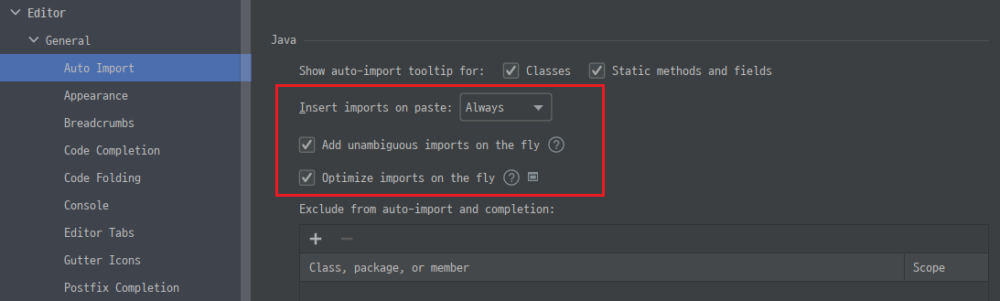
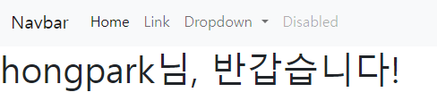

# 스프링부트3 자바 백엔드 개발 입문

```
2024.05.06
```

## 2장 MVC 패턴 이해와 실습 (page 057)

### 2.1 뷰 템플릿과 MVC 패턴


```
뷰 템플릿(View Template)은 화면을 담당하는 기술로,
웹 페이지(View) 를 하나의 틀(Template)로 만들고, 
여기에 변수를 삽입해 서로 다른 페이지로 보여준다.

1장에서 머스테치(Mustache) 를 추가했다. 

Mustache TEMPLATE ENGINES
Logic-less templates for both web and standalone environments. There are no if statements, else clauses, or for loops. Instead there are only tags.

```


### 2.2 MVC 패턴을 활용해 뷰 템플릿 페이지 만들기

###### $WORKSPACE_HOME\$PROJECT_HOME\src\main\resources\templates

#### 2.2.1 뷰템플릿 페이지 만들기
```
$WORKSPACE_HOME\$PROJECT_HOME\src\main\resources\templates

뷰 템플릿은 templates 디렉토리에 만든다.
```

```
빠른 진행을 위해 샘플 예제 파일 사용
```

```
$WORKSPACE_HOME\$PROJECT_HOME\src\main\resources\templates\greetings.mustache  파일생성한다.

확장자 mustache 는 뷰 테플릿을 만드는 도구, 즉 뷰 템플릿 엔진을 의미한다.
머스테치 파일의 기본 위치는 $WORKSPACE_HOME\$PROJECT_HOME\src\main\resources\templates 이다.
이 위치에 머스테치 파일을 저장하면 스프링 부트에서 자동으로 로딩한다.
```

```
머스테치 외의 템플릿 엔진으로는 Thymeleaf, JSP 등이 있다.
```

```
mustache 플러그인 설치한다.
```


##### 머스테치 플러그인 설치방법 
```
ctrl + alt + s 로 settings 진입

- Plugins
    - 상단 검색에서 mustache 로 검색
        - Handlebars/Mustache 를 선택        
```


###### greetings.mustache
```
<html>
<head>
    <meta charset="UTF-8">
</head>
<body>

<!-- content -->
<div class="bg-dark text-white p-5">
    <h1>홍팍님, 반갑습니다!</h1>
</div>
</body>
<html>
```

```
템플릿 파일만 추가한다고, 화면이 보이지 않는다.
```

#### 2.2.2 컨트롤러 만들고 실행하기


###### 어노테이션
```
어노테이션
소스코드에 추가해 사용하는 메타 데이터의 일종이다.
메타 데이터는 프로그램에서 처리해야 할 데이터가 아니라 
컴파일 및 실행과정에서 코드를 어떻게 처리해야 할지 알려주는 추가정보 이다.
자바에서 어노테에션은 앞에 @ 기호를 붙여 사용한다.
```

###### 클래스 패키지 자동으로 임포트하기
```
ctrl + alt + s settings 진입
- Editor   
    - General
        - Auto Import

- Insert imports on paste -> Always : 코드 붙여 넣기시 자동으로 import 
- Add unambiguous imports on the fly : 코드 변경시 필요한 패키지 자동 삽입
- Optimize imports on the fly : 코드 변경시 불필요한 패키지 자동으로 삭제
```

```
[참고]
github 에서 commit 하기 전에는 이미지 파일을 업로드해도 preview 에서는 보이지 않는다.
```



```
1.FirstController 클래스 생성

2.@Controller 어노테이션 추가


package org.example.firstproject;


import org.springframework.stereotype.Controller;
import org.springframework.web.bind.annotation.GetMapping;

@Controller
public class FirstController
{
    @GetMapping("/hi")
    public String niceToMeetYou()
    {
        return "greetings";     // greetings.mustache 파일 반환
    }
}


브라우저에서 확인한다.

http://localhost:8080/hi

```

##### 한글이 깨진다. (?????)
server.servlet.encoding.force=true
```
application.propertiers 파일에 설정을 추가한다.

server.servlet.encoding.force=true

```

##### 인텔리제이 code beautify(code formatter) 단축키
```
ctrl + shift + alt + L
```


#### 2.2.3 모델 추가하기

##### {{변수명}}

##### 머스테치 문법을 사용해 뷰 템플릿 페이지에 변수 삽입
```
{{변수명}}

<body>

<!-- content -->
<div class="bg-dark text-white p-5">
    <h1>{{username}}님, 반갑습니다!</h1>
</div>
</body>

```

```
rerun 후 에러 발생

Whitelabel Error Page
This application has no explicit mapping for /error, so you are seeing this as a fallback.

Mon May 06 09:51:07 KST 2024
There was an unexpected error (type=Internal Server Error, status=500).
No method or field with name 'username' on line 9
com.samskivert.mustache.MustacheException$Context: No method or field with name 'username' on line 9
	at com.samskivert.mustache.Template.checkForMissing(Template.java:344)


No method or field with name 'username' on line 9

greetings.mustache 의 9번라인이 <h1>{{username}}님, 반갑습니다!</h1> 이다.
에러메세지에서 라인번호를 정확히 적시해 준다.
```


```
모델은 컨트롤러의 메소드에서 매개변수로 받아온다.
Model 타입의 model 매개변수를 추가한다.

package org.example.firstproject;


import org.springframework.stereotype.Controller;
import org.springframework.ui.Model;
import org.springframework.web.bind.annotation.GetMapping;

@Controller
public class FirstController
{
    @GetMapping("/hi")
    public String niceToMeetYou(Model model)
    {
        model.addAttribute("username", "hongpark");
        return "greetings";     // greetings.mustache 파일 반환
    }
}


http://localhost:8080/hi

```


### 2.3 MVC 의 역할과 실행 흐름 이해하기

###### goodbye.mustache
```
<html>
<head>
    <meta charset="UTF-8">
</head>
<body>
    <div class="bg-dark text-white p-5">
        <h1>{{nickname}}님, 다음에 또 만나요!</h1>
    </div>

</body>
<html>
```

```
package org.example.firstproject;


import org.springframework.stereotype.Controller;
import org.springframework.ui.Model;
import org.springframework.web.bind.annotation.GetMapping;

@Controller
public class FirstController
{
    @GetMapping("/hi")
    public String niceToMeetYou(Model model)
    {
        model.addAttribute("username", "hongpark");
        return "greetings";     // greetings.mustache 파일 반환
    }

    @GetMapping("/bye")
    public String seeYouNext(Model model)
    {
        model.addAttribute("nickname", "홍길동");
        return "goodbye";       // goodbye.mustache 반환
    }

}


http://localhost:8080/bye

```


#### 2.4 뷰 템플릿 페이지에 레이아웃 적용하기

```
레이아웃(layout) 이란 화면에 요소를 배치하는 일을 말한다.

헤더-푸터 레이아웃(header-footer layout)은 가장 기본이 되는 레이아웃이다.
```


#### 2.4.1 /hi 페이지에 헤더-푸터 레이아웃 적용하기

```
https://getbootstrap.com/

- 책에서는 v.5.0.2 로 하고 있다. 동일하게 간다.

https://getbootstrap.com/docs/5.0/getting-started/introduction/

내려가면 "스타터 템플릿(Starter template) 이 있다.

소스 우상단 "Copy" 버튼으로 복사한다.
```

```
greetings.mustache 에 붙여넣기

주석은 모두 삭제

3단 레이아웃 으로 한다.

기존 코드가 있던 부분은 content, 
그 위는 navigation,
그 아래는 site info 의 3단구조로 잡는다.
```

```
<body>
<!-- naviation -->


<!-- content -->
<h1> {{username}}님, 반갑습니다! </h1>


<!-- site-info -->


<script src="https://cdn.jsdelivr.net/npm/bootstrap@5.0.2/dist/js/bootstrap.bundle.min.js" integrity="sha384-MrcW6ZMFYlzcLA8Nl+NtUVF0sA7MsXsP1UyJoMp4YLEuNSfAP+JcXn/tWtIaxVXM" crossorigin="anonymous"></script>
</body>
```

###### 네이게이션 바 추가하기
```
네비게이션 바는 주로 사용하는 메뉴와 검색창으로 구성되어 있다.
웹 브라우저의 크기에 따라 모양이 바뀌는 반응형 디자인이다.
```

```
https://getbootstrap.com/
https://getbootstrap.com/docs/5.0/getting-started/introduction/

navbar 검색

https://getbootstrap.com/docs/5.0/components/navbar/

```

```
navbar 소스 를 "copy" 버튼 으로 복사후
<!-- naviation --> 아래 붙여넣는다.


서버 재실행하고

http://localhost:8080/hi

웹페이지 상단에 네비게이션 바가 추가되었는지 확인한다.
```




###### 푸터영역 사이트 정보 추가
```
<!-- site-info -->
<div class="mb-5 container-fluid">
    <hr>
    <p>ⓒ CloudStudying | <a href="#">Privacy</a> | <a href="#">Terms</a></p>
</div>
```


###### 도구바 망치 아이콘(build)
```
망치아이콘을 이용하면 프로젝트를 빌드해 수정된 HTML 코드를 좀 더 빠르게 서버에 반영할 수 있다.
```


###### 콘텐츠 class 속성 추가
```
배경색상 어둡게
텍스트 색상은 하얕게
상하좌우 여백은 5배 만큼 늘리기

<!-- content -->
<div class="bg-dark text-white p-5">
    <h1> {{username}}님, 반갑습니다! </h1>
</div>
```


#### 2.4.2 /bye 페이지에 헤더-푸터 레이아웃 적용하기

```
/hi 페이지를 템플릿화 해서 사용한다.
'템플릿화한다'는 말은 코드를 하나의 틀로 만들어 변수화 한다는 말이다.

위에는 {{>header}}
어래는 {{>footer}}

로 처리하는 식이다

```

```
<html> ~ <body> 까지 {{>header}} 로 처리 
</body> ~ </html> 까지 {{>footer}} 로 처리 
```

###### 템플릿 파일 만들고 적용하기(greetings.mustache)

```
1.
templates/layouts 디렉토리 생성

2.
상단 네베게이션바 부분까지를 crop 하고, layouts/header.mustache 파일 생성

3.
해당 부분을 템플릿으로 대체한다.
부 템플릿 파일을 불러올 떄는 일반변수를 {{변수명}} 으로 사용하는 것과 달리
닫는 {{>파일명}} 으로 작성한다.

{{>layout/header}}

라고 작성한다.

4.
푸터 영역을 crop 하고 footer.mustache 파일을 생성한다.


5.
http://localhost:8080/hi

확인한다.
```

###### header.mustache
```
<!doctype html>
<html lang="en">
<head>
    <!-- Required meta tags -->
    <meta charset="utf-8">
    <meta name="viewport" content="width=device-width, initial-scale=1">

    <!-- Bootstrap CSS -->
    <link href="https://cdn.jsdelivr.net/npm/bootstrap@5.0.2/dist/css/bootstrap.min.css" rel="stylesheet" integrity="sha384-EVSTQN3/azprG1Anm3QDgpJLIm9Nao0Yz1ztcQTwFspd3yD65VohhpuuCOmLASjC" crossorigin="anonymous">

    <title>Hello, world!</title>
</head>
<body>
<!-- naviation -->
<nav class="navbar navbar-expand-lg navbar-light bg-light">
    <div class="container-fluid">
        <a class="navbar-brand" href="#">Navbar</a>
        <button class="navbar-toggler" type="button" data-bs-toggle="collapse" data-bs-target="#navbarSupportedContent" aria-controls="navbarSupportedContent" aria-expanded="false" aria-label="Toggle navigation">
            <span class="navbar-toggler-icon"></span>
        </button>
        <div class="collapse navbar-collapse" id="navbarSupportedContent">
            <ul class="navbar-nav me-auto mb-2 mb-lg-0">
                <li class="nav-item">
                    <a class="nav-link active" aria-current="page" href="#">Home</a>
                </li>
                <li class="nav-item">
                    <a class="nav-link" href="#">Link</a>
                </li>
                <li class="nav-item dropdown">
                    <a class="nav-link dropdown-toggle" href="#" id="navbarDropdown" role="button" data-bs-toggle="dropdown" aria-expanded="false">
                        Dropdown
                    </a>
                    <ul class="dropdown-menu" aria-labelledby="navbarDropdown">
                        <li><a class="dropdown-item" href="#">Action</a></li>
                        <li><a class="dropdown-item" href="#">Another action</a></li>
                        <li><hr class="dropdown-divider"></li>
                        <li><a class="dropdown-item" href="#">Something else here</a></li>
                    </ul>
                </li>
                <li class="nav-item">
                    <a class="nav-link disabled" href="#" tabindex="-1" aria-disabled="true">Disabled</a>
                </li>
            </ul>
            <form class="d-flex">
                <input class="form-control me-2" type="search" placeholder="Search" aria-label="Search">
                <button class="btn btn-outline-success" type="submit">Search</button>
            </form>
        </div>
    </div>
</nav>
```

###### greetings.mustache
```
{{>layouts/header}}

<!-- content -->
<div class="bg-dark text-white p-5">
    <h1> {{username}}님, 반갑습니다! </h1>
</div>

{{>layouts/footer}}
```


###### footer.mustache
```
<!-- site-info -->
<div class="mb-5 container-fluid">
    <hr>
    <p>ⓒ CloudStudying | <a href="#">Privacy</a> | <a href="#">Terms</a></p>
</div>

<script src="https://cdn.jsdelivr.net/npm/bootstrap@5.0.2/dist/js/bootstrap.bundle.min.js" integrity="sha384-MrcW6ZMFYlzcLA8Nl+NtUVF0sA7MsXsP1UyJoMp4YLEuNSfAP+JcXn/tWtIaxVXM" crossorigin="anonymous"></script>
</body>
</html>
```


### -- 끝 -- (page 094)
