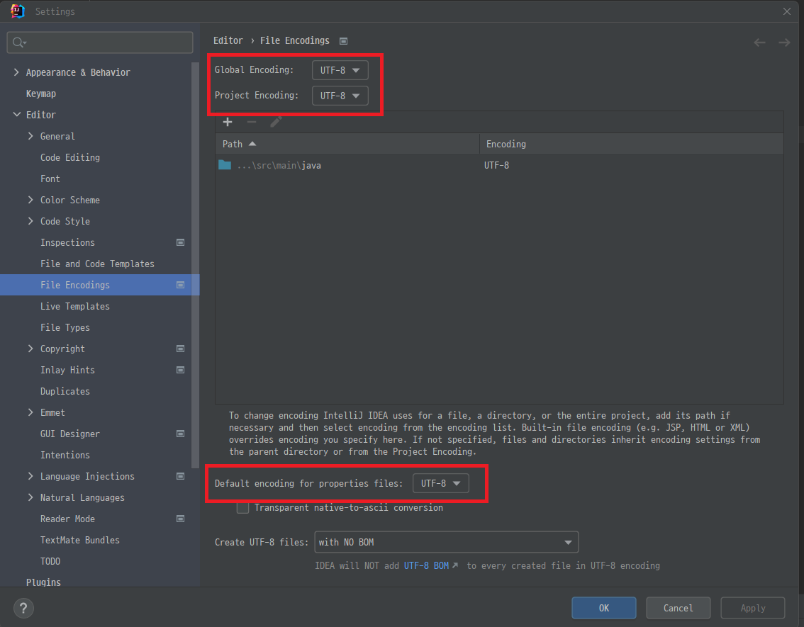

# 스프링부트3 자바 백엔드 개발 입문

```
2024.05.06
```

## 3장 게시판 만들고 새 글 작성하기 : Create


### 3.1 폼 데이터란

```
폼 데이터
폼 데이터란 HTML 요소인 form 태그에 실려 전송되는 데이터를 말한다.

DTO(Data Transfer Object)
<form> 태그에 실에보낸 데이터는 서버의 컨트롤러가 객체에 담아 받는다.
이 객체를 DTO 라고 한다.
```


### 3.2 폼 데이터를 DTO 로 받기

###### articles/new.mustache
```
{{>layouts/header}}

<form class="container" action="/articles/create" method="post">
    <div class="mb-3">
        <label class="form-label">제목</label>
        <input type="text" class="form-control" name="title">
    </div>
    <div class="mb-3">
        <label class="form-label">내용</label>
        <textarea class="form-control" rows="3" name="content"></textarea>
    </div>
    <button type="submit" class="btn btn-primary">Submit</button>
    <a href="/articles">Back</a>
</form>

{{>layouts/footer}}
```

###### ArticleController.java
```
package org.example.firstproject;


import org.springframework.stereotype.Controller;
import org.springframework.web.bind.annotation.GetMapping;

@Controller
public class ArticleController
{

    @GetMapping("/articles/new")
    public String newArticleForm()
    {
        return "articles/new";
    }
}

```

```
http://localhost:8080/articles/new

```


#### 3.2.3 폼데이터 전송하기
```
<form class="container" action="/articles/create" method="post">

어디에 볼지는 action 속성으로
어떻게 보낼지는 method 속성으로 설정한다.
```


#### 3.2.4 폼 데이터 받기

###### ArticleController.java
```
package org.example.firstproject.controller;


import org.springframework.stereotype.Controller;
import org.springframework.web.bind.annotation.GetMapping;
import org.springframework.web.bind.annotation.PostMapping;

@Controller
public class ArticleController
{

    @GetMapping("/articles/new")
    public String newArticleForm()
    {
        return "articles/new";
    }


    @PostMapping("/articles/create")
    public String createArticle()
    {
        return "";
    }
}

```


#### 3.2.5 DTO 만들기
###### ArticleForm.java
```
package org.example.firstproject.dto;

public class ArticleForm
{
    private final String title;
    private final String content;

    public ArticleForm(String title, String content)
    {
        this.title = title;
        this.content = content;
    }

    @Override
    public String toString()
    {
        return "ArticleForm{" + "title='" + title + '\'' + ", content='" + content + '\'' + '}';
    }
}
```


#### 3.2.6 폼 데이터를 DTO 에 담기
```
폼 데이터를 DTO 로 받는다.

    @PostMapping("/articles/create")
    public String createArticle(ArticleForm form)
    {
        log.info(String.format("[ArticleController/createArticle] form:[%s]", form));
        return "";
    }
```

#### 3.2.7 입력폼과 DTO 필드 연결하기
```
        <input type="text" class="form-control" name="title">               // DTO 의 title 과 연결
        <textarea class="form-control" rows="3" name="content"></textarea>  // DTO 의 content 와 연결
```

```
2024-05-06T14:15:23.317+09:00  INFO 3460 --- [firstproject] [nio-8080-exec-2] o.e.f.controller.ArticleController       : [ArticleController/createArticle] form:[ArticleForm{title='abcd', content='1234'}]

```


### 3.3 DTO 를 데이터베이스에 저장하기

#### 3.3.1 데이터베이스와 JPA
```
JPA(Java Persistence API)
자바 언어로 DB 에 명령을 내리는 도구로, 데이터를 객체지향적으로 관리할 수 있게 해준다.

JPA 의 핵심도구로는 엔티티 와 리파지터리가 있습니다.


엔티티 : 
- 자바객체를 DB 가 이해할 수 있게 만든 것으로, 이를 기반으로 테이블이 만들어진다.

리파지터리 : 
- 엔티티가 DB 속 테이블에 저장 및 관리될 수 있게 하는 인터페이스이다.
```


###### Article 클래스 만들기
```
1. entity 패키지 생성
```

```
2. Article 클래스 생성
package org.example.firstproject.entity;


import jakarta.persistence.Column;
import jakarta.persistence.Entity;
import jakarta.persistence.GeneratedValue;
import jakarta.persistence.Id;

@Entity     // 엔티티선언
public class Article
{
    @Id     // 엔티티의 대푯값 지정
    @GeneratedValue     // 자동 생성 기능 추가(숫자가 자동으로 매겨짐)
    private Long id;

    @Column
    private String title;       // title 필드 선언. DB 테이블의 title 열과 연결됨

    @Column
    private String content;     // content 필드 선언. DB 테이블의 content 열과 연결됨


    public Article(Long id, String title, String content)
    {
        this.id = id;
        this.title = title;
        this.content = content;
    }

    @Override
    public String toString()
    {
        return "Article{" + "id=" + id + ", title='" + title + '\'' + ", content='" + content + '\'' + '}';
    }

}
```
```
3. 
ArticleForm.toEntity() 메소드 구현

package org.example.firstproject.dto;

import org.example.firstproject.entity.Article;

public class ArticleForm
{
    private final String title;
    private final String content;

    public ArticleForm(String title, String content)
    {
        this.title = title;
        this.content = content;
    }

    @Override
    public String toString()
    {
        return "ArticleForm{" + "title='" + title + '\'' + ", content='" + content + '\'' + '}';
    }

    public Article toEntity()
    {
        return new Article(null, title, content);
    }
}

```

```
4. ArticleController 에 toEntity() 적용

    @PostMapping("/articles/create")
    public String createArticle(ArticleForm form)
    {
        log.info(String.format("[ArticleController/createArticle] form:[%s]", form));

        // 1. DTO 를 엔티티로 변환
        Article article = form.toEntity();

        // 2. 리파지토리로 엔티티를 DB 에 저장

        return "";
    }
```    


#### 3.3.3 리파지토리로 엔터티를 DB 에 저장하기

###### 리파지터리 만들기

```
1. repository 패키지 생성

2. ArticleRepository interface 생성

package org.example.firstproject.repository;

public interface ArticleRepository
{
}


3. JPA 에서 제공하는 리파지터리 인터페이스를 활용해 만든다.

extends CrudRepository<T, ID>를 선택


4. 
CrudRepository 는 JPA 에서 제공하는 인터페이스로 이를 상속해 엔티티를 관리(생성, 조회, 수정, 삭제)할 수 있다.
CrudRepository 는 2개의 2개의 제네릭 요소를 받는다.

Article : 관리대상 엔티티의 클래스 타입이다. 여기서는 Article 이다.
Long : 관리대상 엔티티의 대푯값 타입이다. Article.java 에서 id 를 대푯값으로 지정했다. id 타입은 Long 이므로 Long 을 입력한다.

package org.example.firstproject.repository;

import org.example.firstproject.entity.Article;
import org.springframework.data.repository.CrudRepository;

public interface ArticleRepository extends CrudRepository<Article, Long>
{
}
```
```
5. Controller 에 ArticleRepositrory 선언 및 구현

package org.example.firstproject.controller;

import lombok.extern.slf4j.Slf4j;
import org.example.firstproject.dto.ArticleForm;
import org.example.firstproject.entity.Article;
import org.example.firstproject.repository.ArticleRepository;
import org.springframework.beans.factory.annotation.Autowired;
import org.springframework.stereotype.Controller;
import org.springframework.web.bind.annotation.GetMapping;
import org.springframework.web.bind.annotation.PostMapping;

@Controller
@Slf4j
public class ArticleController
{

    @Autowired
    private ArticleRepository articleRepository;

    @GetMapping("/articles/new")
    public String newArticleForm()
    {
        return "articles/new";
    }


    @PostMapping("/articles/create")
    public String createArticle(ArticleForm form)
    {
        log.info(String.format("[ArticleController/createArticle] form:[%s]", form));

        // 1. DTO 를 엔티티로 변환
        Article article = form.toEntity();
        log.info(String.format("[ArticleController/createArticle] article:[%s]", article));

        // 2. 리파지토리로 엔티티를 DB 에 저장
        Article saved = articleRepository.save(article);
        log.info(String.format("[ArticleController/createArticle] saved:[%s]", saved));

        return "";
    }
}
```

###### 객체 주입하기
```
    @Autowired
    private ArticleRepository articleRepository;

ArticleRepositoryImpl() 같은 구현체를 만들지 않아도 된다.
스프링 부트가 알아서 객체를 만든다.
@Autowired 어노테이션을 붙이면 스프링 부트가 미리 생성해 놓은 객체를 연결해 준다. (DI)
```

```
2024-05-06T14:49:50.056+09:00  INFO 13720 --- [firstproject] [nio-8080-exec-2] o.e.f.controller.ArticleController       : [ArticleController/createArticle] form:[ArticleForm{title=' 가가가가', content='1111'}]
2024-05-06T14:49:50.056+09:00  INFO 13720 --- [firstproject] [nio-8080-exec-2] o.e.f.controller.ArticleController       : [ArticleController/createArticle] article:[Article{id=null, title=' 가가가가', content='1111'}]
2024-05-06T14:49:50.102+09:00  INFO 13720 --- [firstproject] [nio-8080-exec-2] o.e.f.controller.ArticleController       : [ArticleController/createArticle] saved:[Article{id=1, title=' 가가가가', content='1111'}]
```


###### 인텔리제이 한글 깨짐 해결 방법
###### 작업 1-1)
```

"ctrl + alt + s" settings 진입

- Editor
    - File Encodings

변경한다.

- Global Encoding : UTF-8
- Project Encoding : UTF-8
- Default encoding for properties files : UTF-8
```


###### 작업 1-2)
```
1. 
메뉴바 Help > "Edit Custom VM Options" 선택


2.
-Dfile.encoding=UTF-8

추가한다.

-Xmx8192m
-Dfile.encoding=UTF-8


3. 
인텔리제이를 재실행 한다.
```

### -- 끝 -- 
